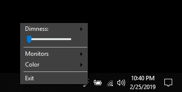

DimScreen
=========

Allows you to dim your desktop if it's a bit too bright.

##Features
- Multiple monitors
- Command line support
- Smooth transitions!
- Clean UI
- Monitor specific overlays
- Custom dimness color
